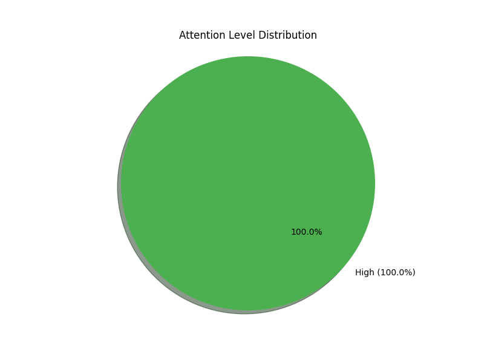

# Behavior Analysis Report for Devansh

**Report Date:** 2025-05-09
**Session Duration:** 0.0 minutes
**Total Observations:** 1

## Attention Overview

### Key Findings

- **Focused Time:** 100.0%
- **Partially Engaged:** 0.0%
- **Disengaged:** 0.0%

## Detailed Analysis

### Distraction Analysis

No distractions detected.

### Posture Assessment

Overall good posture, with proper positioning 100.0% of the time.

### Emotional State

Mixed emotional states with no clear pattern. Dominant emotion: Unknown (100.0%).

### Gaze Tracking

Mixed gaze patterns with no clear trend.

### Specific Behaviors

Behavior analysis:
- Was attentive during 100.0% of observations.

## Recommendations

1. Continue with current level of engagement and attention.

---
*This report was automatically generated based on behavioral monitoring data.*
*For questions or concerns, please contact the instructor.*
