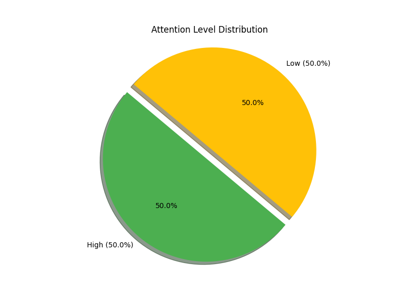

# Behavior Analysis Report for Shubham

**Report Date:** 2025-04-26
**Session Duration:** 0.5 minutes
**Total Observations:** 6

## Attention Overview

### Key Findings

- **Focused Time:** 50.0%
- **Partially Engaged:** 0.0%
- **Disengaged:** 50.0%

## Detailed Analysis

### Distraction Analysis

Main sources of distraction:
- Looking left: 2 instances (66.7%)
- Blinking: 1 instances (33.3%)

### Posture Assessment

Overall good posture, with proper positioning 100.0% of the time.

### Emotional State

Mixed emotional states with no clear pattern. Dominant emotion: Unknown (100.0%).

### Gaze Tracking

Frequently looking away from center (50.0% of observations).

### Specific Behaviors

Behavior analysis:
- Was attentive during 100.0% of observations.

## Recommendations

1. Work on maintaining focus during class. Consider removing distractions like phones.
2. Try to maintain visual focus on the instructional content.

---
*This report was automatically generated based on behavioral monitoring data.*
*For questions or concerns, please contact the instructor.*
